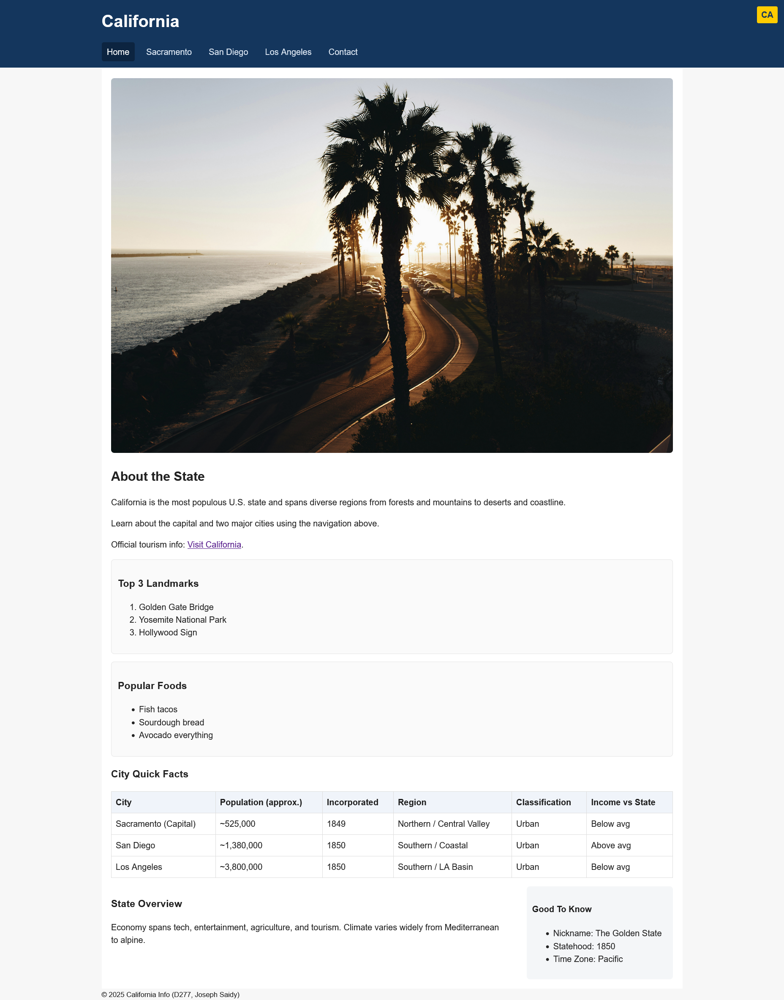
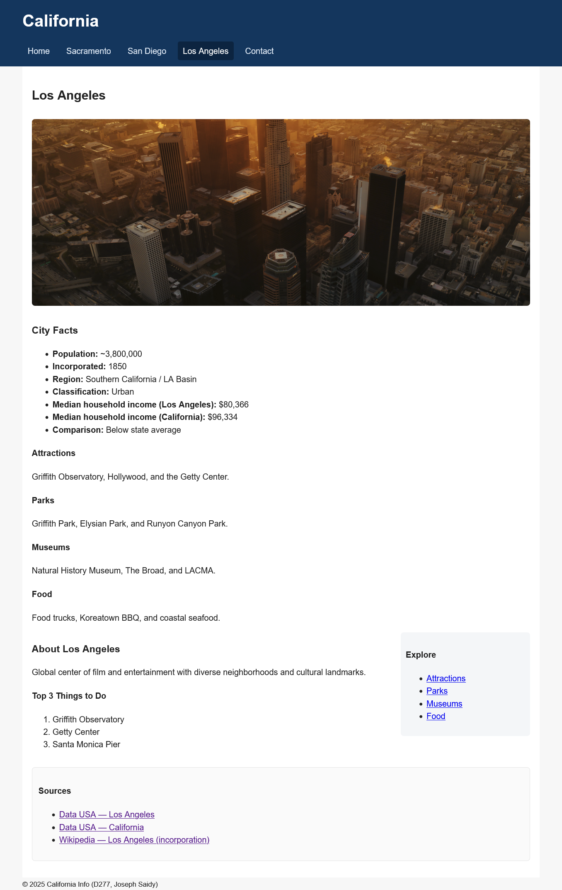

# California Info Site
Simple multipage site (HTML/CSS/JS) showcasing a state overview and three city pages.

**Live demo:** https://josephsaidy.github.io/california-info-site/

## Features
- Responsive layout
- Internal anchor links (“Explore” sections)
- Contact form with email match validation
- Table + lists + images

## Tech
HTML · CSS · JS (no frameworks)

## Screens

